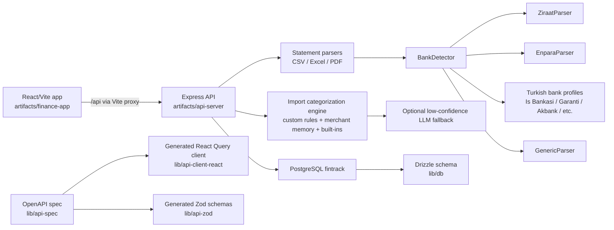
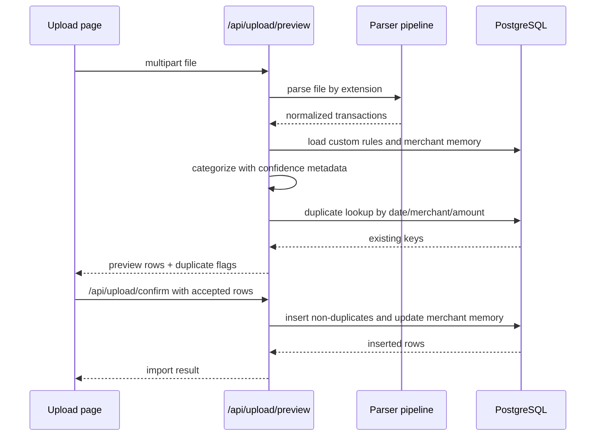

# FinanceAnalyzerPro Architecture

This document describes the current local architecture of FinanceAnalyzerPro as inspected in the codebase.

## 1. Overall System Architecture

FinanceAnalyzerPro is a pnpm monorepo with a React/Vite frontend, an Express API server, shared generated API clients, and a PostgreSQL database accessed through Drizzle ORM.



The frontend calls generated React Query hooks where available. The upload page uses direct `fetch` for multipart upload and confirm requests. The API validates request/response payloads with generated Zod schemas from `@workspace/api-zod`.

## 2. Frontend Structure

Frontend root: `artifacts/finance-app`.

Key files:

- `src/App.tsx`: Wouter routing and React Query provider.
- `src/components/layout.tsx`: Sidebar, mobile drawer, and navigation.
- `src/pages/dashboard.tsx`: Period-filtered dashboard KPIs, charts, category trends, recent transactions, recurring payments.
- `src/pages/transactions.tsx`: Transaction table, filters, inline category editing, bulk actions, quick review, rule creation from rows.
- `src/pages/upload.tsx`: Statement upload, preview, duplicate warning, import confirmation.
- `src/pages/categories.tsx`: Built-in categories, manual custom rules, rule suggestions, apply rules.
- `src/pages/budgets.tsx`: Monthly category budgets.
- `src/pages/insights.tsx`: Rule-based insights, recurring merchants, unusual merchants.
- `src/pages/settings.tsx`: Demo data, delete-all-data confirmation, privacy note.
- `src/components/ui/*`: shadcn/Radix UI components.

The Vite config proxies `/api` to `localhost:8080` in local development.

## 3. Backend Structure

Backend root: `artifacts/api-server`.

Key files:

- `src/app.ts`: Express app, logging, CORS, body parsing, route mounting.
- `src/index.ts`: Reads `PORT` and starts the server.
- `src/routes/index.ts`: Registers feature routers under `/api`.
- `src/routes/upload.ts`: Upload preview, upload confirm, one-step upload.
- `src/routes/transactions.ts`: Transaction list, filters, updates, delete, bulk categorize/review.
- `src/routes/rules.ts`: Custom rules, rule suggestions, drafts, apply rules.
- `src/routes/dashboard.ts`: Aggregated dashboard data.
- `src/routes/insights.ts`: Rule-based financial insights.
- `src/routes/budgets.ts`: Budget CRUD.
- `src/routes/demo.ts`: Demo data seed and delete-all-data.
- `src/routes/health.ts`: API and database health checks.
- `src/lib/parsers.ts`: CSV/Excel/PDF entry points and PDF diagnostics.
- `src/lib/statement-parsers/*`: Bank detection, bank-specific parsers, text utilities, merchant normalization.
- `src/lib/import-categorization.ts`: Import-time category decisions using custom rules, merchant memory, parser rules, built-ins, and optional low-confidence LLM fallback.
- `src/lib/merchant-memory.ts`: Persistent merchant recognition and learning from imports, rules, and user corrections.
- `src/lib/categorizer.ts`: Built-in category keyword rules and custom-rule matching.
- `src/lib/rule-suggestions.ts`: Deterministic rule suggestions and rule drafts.

## 4. Database Structure

Database schema lives in `lib/db/src/schema`.

### `transactions`

Stores imported and edited transactions.

- `id`: serial primary key
- `date`: ISO-like string date
- `merchant`: normalized merchant display name
- `description`: masked transaction description
- `amount`: numeric(12,2)
- `type`: `debit` or `credit`
- `currency`: currency string, default `TRY`
- `transactionKind`: semantic transaction kind such as `pos`, `fast`, `eft`, `salary`, `subscription`, or `credit_card_payment`
- `bank`: detected bank/profile id
- `parser`: parser name/id
- `balance`: optional row balance
- `category`: category id, default `other`
- `categorizationConfidence`, `categorizationSource`, `categorizationExplanation`: category audit metadata
- `importConfidence`: parser/import confidence score
- `month`: `YYYY-MM`
- `notes`: optional user notes
- `reviewed`: boolean used by Needs Review workflow
- `createdAt`, `updatedAt`

### `budgets`

Stores monthly category budgets.

- `id`
- `category`
- `month`
- `amount`
- `createdAt`, `updatedAt`
- unique constraint on `(category, month)`

### `categorization_rules`

Stores user-created categorization rules.

- `id`
- `pattern`
- `category`
- `priority`
- `createdAt`

### `merchants`

Stores persistent merchant recognition memory.

- `id`
- `merchantKey`: normalized stable merchant key, unique
- `displayName`: canonical display merchant
- `category`
- `pattern`
- `source`: `import`, `user_correction`, `custom_rule`, or deterministic source
- `confidence`
- `timesSeen`
- `lastSeenAt`, `createdAt`, `updatedAt`

## 5. Drizzle ORM Usage

Drizzle is configured in `lib/db`.

- `lib/db/src/index.ts` creates a `pg.Pool` with `DATABASE_URL` and exports `db`.
- `lib/db/src/schema/*.ts` define the tables with `pgTable`.
- Route code imports `db` and schema tables from `@workspace/db`.
- Queries use Drizzle helpers such as `eq`, `and`, `inArray`, `desc`, `asc`, and parameterized `sql` templates.
- Local schema synchronization uses `pnpm --filter @workspace/db run push`, which runs Drizzle Kit push.

## 6. PostgreSQL Local Setup

The expected local database is `fintrack` on PostgreSQL.

Typical setup:

```powershell
cd C:\Projects\FinanceAnalyzerPro
Copy-Item .env.example .env
# edit DATABASE_URL
pnpm --filter @workspace/db run push
```

The local workspace can also run a PostgreSQL cluster under `.local/postgres-data`, which is ignored by git.

## 7. Upload Statement Flow



There is also a legacy one-step `POST /api/upload` route that parses and saves immediately.

## 8. PDF/CSV/Excel Parsing Flow

`src/lib/parsers.ts` exposes:

- `parseCsv(filePath)`: reads UTF-8 CSV, parses with PapaParse, normalizes rows into the canonical import schema.
- `parseExcel(filePath)`: reads first worksheet with `xlsx`, normalizes rows into the canonical import schema.
- `parsePdf(filePath, options)`: reads PDF buffer, extracts selectable text with `pdf-parse`, then calls `parsePdfText`.
- `parsePdfText(rawText)`: calls `parseStatementText` in the bank parser module and converts normalized transactions to API parser rows.

Parsing does not use OCR. PDF debug mode can save extracted text and return diagnostics when no transactions match.

## 9. Bank-Specific Parser Logic

The bank-specific parser system is in `src/lib/statement-parsers`.

- `BankDetector` scores all parsers and selects the highest confidence parser.
- `ZiraatParser` detects Ziraat/Bankkart statements and reads rows after the Bankkart table header. It expects `dd.MM.yyyy` dates and trailing TL amount columns.
- `EnparaParser` detects Enpara credit card statements and reads rows after the `Islem tarihi Aciklama Taksit Tutar` header. It supports installment/foreign-currency hints and single amount columns.
- Turkish bank profile parsers detect Is Bankasi, Garanti BBVA, Akbank, Yapi Kredi, QNB/Finansbank, VakifBank, Halkbank, and Kuveyt Turk from bank keywords/card brands, then use generic Turkish transaction table rules until bank-specific sampled layouts are added.
- `GenericParser` groups lines by transaction-like date blocks, detects amount columns, optional debit/credit labels, and optional balance columns.

Each parser returns a `StatementParseResult` with layout metadata, parser confidence, normalized transactions, discovered rules, recurring subscriptions, salary signals, and warnings.

## 10. Transaction Normalization

Normalized transactions use the schema:

```ts
{
  date,
  description,
  merchant,
  amount,
  currency,
  transactionType, // debit or credit
  transactionKind, // pos, eft, fast, salary, refund, etc.
  balance,
  category,
  categorizationConfidence,
  categorizationSource,
  categorizationExplanation,
  bank,
  parser,
  confidence
}
```

Dates are normalized to `YYYY-MM-DD`. Amount parsing supports Turkish and common decimal/thousands formats. Descriptions are cleaned of dates, amounts, POS/reference/auth codes, masked card fragments, timestamps, installments, and obvious metadata. Sensitive numbers are masked by parser text utilities before storage.

## 11. Merchant Normalization

Merchant normalization is deterministic in `merchant-normalizer.ts`.

The normalizer:

- masks sensitive data first
- removes dates, installments, IDs, and city suffixes
- matches known merchant patterns such as Migros, A101, Bim, Sok, Carrefour, Spotify, Netflix, Steam, Apple, Google, Amazon, Trendyol, Obilet, Petrol Ofisi, Shell, Opet, BP, and others
- falls back to a title-cased merchant from the cleaned description
- returns a category and confidence with the merchant
- produces a normalized merchant key used by the persistent `merchants` table

## 12. Categorization Engine

Import categorization is orchestrated in `import-categorization.ts`.

Decision order:

1. User custom rules, matched by normalized substring.
2. Persistent merchant memory from previous imports, rules, and user corrections.
3. Parser merchant rules from deterministic merchant normalization.
4. Built-in category keyword rules.
5. Optional LLM fallback only when explicitly enabled and deterministic confidence is below `LLM_CATEGORIZATION_CONFIDENCE_THRESHOLD`.

Categories include groceries, food, transportation, bills, subscriptions, shopping, education, health, entertainment, rent, income, and other.

LLM calls are disabled by default and require `LLM_CATEGORIZATION_ENABLED=true`, `LLM_CATEGORIZATION_ENDPOINT`, and `LLM_CATEGORIZATION_API_KEY`.

## 13. Custom Rules

Custom rules live in `categorization_rules`.

Custom rules can be created from:

- the manual form on Categories & Rules
- rule suggestions
- one transaction
- multiple selected transactions
- the smart prompt after inline category edits

Rules are ordered by priority and creation time in backend queries. User-created rules override built-ins for imports and rule application. Inline category changes, bulk categorization, rule creation from transactions, and rule application also update merchant memory with high confidence so future imports improve automatically.

## 14. Rule Suggestions

`rule-suggestions.ts` scans existing transactions and suggests deterministic rules when:

- a transaction is categorized as `other`
- a transaction category differs from deterministic merchant/category rules
- no equivalent custom rule exists

Suggestions group similar merchants/descriptions, provide a rule pattern, suggested category, confidence, sample descriptions, and current category counts.

## 15. Duplicate Detection

Duplicate detection runs in upload preview after categorization and merchant-memory normalization.

The API:

1. Parses candidate transactions.
2. Validates upload extension, MIME metadata, and file signature/content before parser execution.
3. Writes temporary files under `.local/uploads` with UUID filenames, then deletes them after parsing.
4. Finds existing transactions with matching dates.
5. Builds keys as `date|merchant|amount` using the normalized preview merchant.
6. Flags matching preview rows as duplicates.

If the database is unavailable during preview, parsing still succeeds and the response includes a warning that duplicate detection was skipped.

## 16. Dashboard Data Flow

Dashboard data is served by `GET /api/dashboard`.

The endpoint accepts period filters:

- `period=this_month`
- `period=last_3_months`
- `period=last_6_months`
- `period=this_year`
- `period=last_12_months`
- `period=custom&startDate=YYYY-MM-DD&endDate=YYYY-MM-DD`

The older `month=YYYY-MM` query is retained for compatibility and is converted into a custom date range internally.

The API aggregates:

- income, expenses, net balance, transaction count
- spending by category
- category percentages and month-by-month category trends
- top merchants
- monthly trends with zero-filled empty months
- recent transactions
- biggest expenses
- recurring payments based on merchants seen across months

All dashboard filtering uses `transactions.date`, not import timestamps. Period math and grouping live in `artifacts/api-server/src/lib/dashboard-periods.ts`.

The frontend persists the selected period and custom dates in browser `localStorage`, then displays the response using Recharts, summary cards, and compact category trend tables.

## 17. API Endpoints

Primary endpoints:

- `GET /api/healthz`
- `GET /api/health/db`
- `POST /api/upload`
- `POST /api/upload/preview`
- `POST /api/upload/confirm`
- `GET /api/transactions`
- `GET /api/transactions/months`
- `POST /api/transactions/bulk-categorize`
- `POST /api/transactions/bulk-review`
- `PATCH /api/transactions/:id`
- `DELETE /api/transactions/:id`
- `GET /api/dashboard`
- `GET /api/categories`
- `GET /api/budgets`
- `PUT /api/budgets/:month/:category`
- `DELETE /api/budgets/:month/:category`
- `GET /api/rules`
- `POST /api/rules`
- `GET /api/rules/suggestions`
- `POST /api/rules/draft`
- `POST /api/rules/from-transactions`
- `POST /api/rules/apply`
- `POST /api/rules/apply-selected`
- `DELETE /api/rules/:id`
- `GET /api/insights`
- `POST /api/demo`
- `DELETE /api/data`

The canonical API contract is `lib/api-spec/openapi.yaml`.

## 18. Environment Variable Loading

Environment loading is centralized in `lib/db/src/env.ts`.

Resolution order:

1. `FINANCE_ANALYZER_ENV_FILE`, if set and existing.
2. Search upward from `process.cwd()` for `.env`.
3. Search upward from the DB package runtime path for `.env`.

The API start script also uses Node's `--env-file-if-exists=../../.env`. The DB package uses `process.env[key] ??= value`, so already-set environment values are not overwritten.

`getDatabaseEnvironmentInfo()` sanitizes `DATABASE_URL` by redacting the password.

## 19. Local Development Startup Flow

Local startup:

```powershell
cd C:\Projects\FinanceAnalyzerPro
pnpm install
pnpm --filter @workspace/db run push
pnpm --filter @workspace/api-server run dev
pnpm --filter @workspace/finance-app run dev
```

The API listens on `PORT` or 8080. The frontend listens on 5173 by default and proxies `/api` to the API server.

## 20. Current Limitations

- No authentication or authorization; local single-user use is assumed.
- No per-user data isolation.
- No persistent audit log.
- No background job queue for large imports.
- No production migration workflow is implemented in scripts; README recommends Drizzle migrations for production.
- PDF parsing depends on selectable text and known bank layouts; OCR is intentionally not used.
- No AI integration yet; future AI use must anonymize data before external calls.
- Health endpoints expose operational metadata suitable for local development, but should be restricted or reduced in production.
